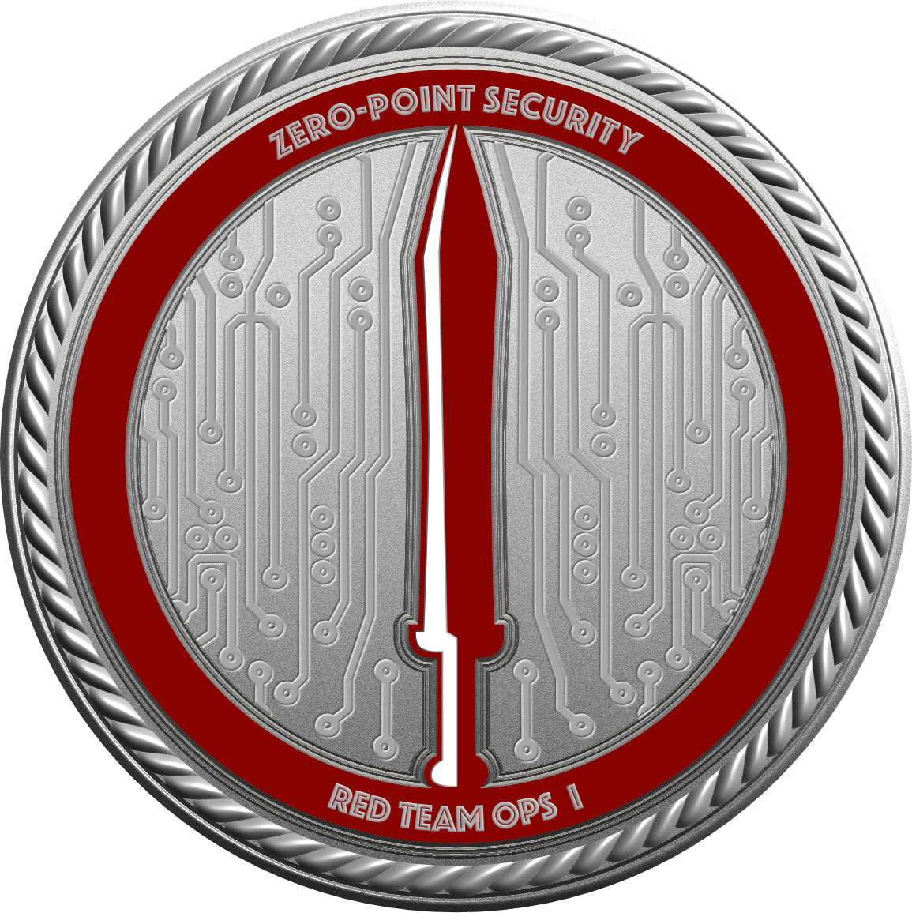

# Introduction

<figure><figcaption></figcaption></figure>

This certification aims to teach the fundamental concepts and skillsets required to get started in the field of red teaming. We'll begin with some theory about how to plan and approach an engagement, and how each stage of the attack lifecycle can be tackled (from initial compromise to domain takeover). Along the way, we'll highlight some tactics to avoid (and why) and suggest suitable alternatives.
